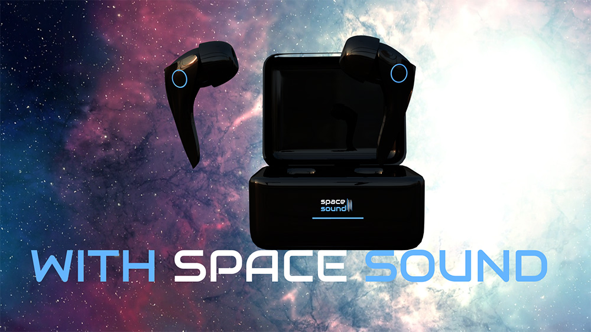

# Nascimento Rodrigo - earbuds promo site

Attempt to create a promotional website for the launch of headphones. The work was difficult, but I believe I was able to achieve a good result, within expectations. We used JS, AF, Cinema 4d and HTML + CSS (SASS).

## Installation
No installation required

## Technology Used
1. Figma
2. HTML + CSS (Sass) + Java Script (Green Socks)
3. Cinema 4d

## History
Novamber 2024

## Wireframe
1. https://www.figma.com/proto/JR394GEozvJeDdalpe4VJR/Untitled?node-id=45-16&node-type=frame&t=sFlsXFeCZ1BVC595-1&scaling=scale-down-width&content-scaling=fixed&page-id=0%3A1

